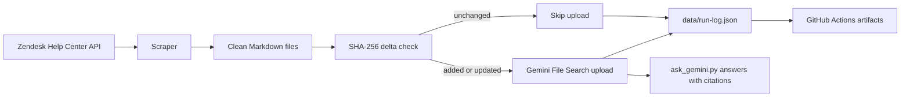

# kb-harvest

OptiBot mini-clone take-home: scrape OptiSigns support articles, normalize them to Markdown, upload changed files to Gemini File Search by API, and ask grounded support questions from the terminal.

## Flow



## Setup

```bash
python3 -m venv .venv
source .venv/bin/activate
pip install -r requirements.txt
cp .env.sample .env
```

Fill `.env` with `GEMINI_API_KEY`. `GEMINI_FILE_SEARCH_STORE_NAME` is optional; if blank, `main.py` creates a store and saves it in `data/state.json`.

## Run

Run one full scrape/upload sync:

```bash
python3 main.py
```

Ask the bot:

```bash
python3 ask_gemini.py "How do I add a YouTube video?"
```

Fetch the latest GitHub Actions-generated data back to local:

```bash
python3 scripts/fetch_github_actions_data.py
```

If artifact download requires auth:

```bash
export GH_TOKEN=REPLACE_WITH_TOKEN
python3 scripts/fetch_github_actions_data.py
```

## Docker

```bash
docker build -t kb-harvest .
docker run --env-file .env kb-harvest
```

Prompt-compatible run:

```bash
docker run -e API_KEY=REPLACE_ME kb-harvest
```

## Daily Job

GitHub Actions workflow: `.github/workflows/daily-sync.yml`

Schedule: daily at `02:00 UTC`

Last run logs: https://github.com/nlgiahuy01112003/kb-harvest/actions

Required repository secrets:

```txt
GEMINI_API_KEY
GEMINI_FILE_SEARCH_STORE_NAME
```

Artifacts produced by each run:

```txt
generated-markdown -> data/markdown/*.md
run-log            -> data/run-log.json
sync-state         -> data/state.json
```

## Implementation Notes

- Scraping uses Zendesk Help Center API instead of browser HTML scraping.
- The job pulls at least 30 articles and always includes article `360051014713` for the YouTube demo question.
- Markdown keeps headings, code blocks, useful links, and an `Article URL:` citation line.
- Delta detection uses SHA-256 hashes stored in `data/state.json`.
- Only added or updated Markdown files are uploaded to Gemini.
- Gemini chunking uses 512-token whitespace chunks with 100-token overlap.
- Secrets stay outside git: `.env` is ignored and `.env.sample` documents required variables.

## Code Map

| File | Role |
| --- | --- |
| `main.py` | Orchestrates the sync: config, scrape, delta check, Gemini upload, run log |
| `scraper.py` | Calls Zendesk API, writes Markdown files, updates article state |
| `markdown_cleaner.py` | Removes page noise, normalizes links, converts HTML to Markdown |
| `gemini_uploader.py` | Creates/reuses Gemini File Search Store, uploads files, asks questions |
| `ask_gemini.py` | Small CLI for testing the assistant answer |
| `state.py` | JSON state helpers and SHA-256 hashing |
| `scripts/fetch_github_actions_data.py` | Downloads latest GitHub Actions artifacts into local `data/` |
| `.github/workflows/daily-sync.yml` | Daily cloud sync job |
| `.github/workflows/ci.yml` | Tests, secret scan, deliverable check, Docker build |

## Checklist

| Requirement | Status |
| --- | --- |
| Free OptiSigns/Gemini warm-up | Manual account step |
| Scrape 30+ support articles | Done |
| Convert articles to clean Markdown | Done |
| Preserve links/headings/code and remove nav noise | Done |
| API-based Gemini File Search upload | Done |
| Log file/chunk/upload counts | Done |
| `main.py` wraps scraper/uploader | Done |
| Dockerfile runs once and exits | Done |
| Daily cloud job with artifacts/logs | Done |
| Clear `.env.sample`, no hard-coded keys | Done |
| Tests for bonus points | Done |
| Screenshot of YouTube answer | Save as `screenshots/youtube-answer.png` |

## Verify

```bash
python3 scripts/check_deliverables.py
python3 scripts/check_no_secrets.py
pytest -q
```

Sample question for the screenshot:

```txt
How do I add a YouTube video?
```
