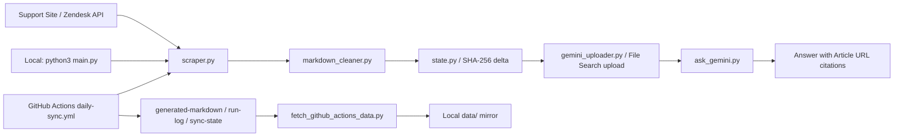

# Section 1: Introduction And Planning

# Rebuild From Scratch

This document is a presentation and live-coding script for the take-home project. Use it to explain the plan, rebuild the project from a blank folder, and answer review questions in a focused 15-minute walkthrough.

## 0. Presentation Opening

### 0.0.1 Short Personal Introduction

Say this first:

```txt
Hi, my name is Nguyen Le Gia Huy. I am a backend-oriented full-stack developer. My main stack is TypeScript, NestJS, Next.js, PostgreSQL, Prisma, Docker, and API/backend system design.

In previous projects, I focused on building practical systems such as an e-commerce backend with payments, inventory consistency, PostgreSQL transactions, and an admin dashboard. For this take-home, I treated the problem in the same way: first understand the real data flow, then build a small but reliable system around it.
```

Why this intro works:

```txt
It connects your portfolio background to this assignment:
- You have backend/API experience.
- You care about data consistency.
- You approach the project as a production-style pipeline, not only as a demo chatbot.
```

### 0.0.2 Work Timeline Since Receiving The Email

Use this timeline to show how you approached a new topic under a short deadline.

```txt
Yesterday 3:00 PM:
I received the home test email and first read the deliverables: scrape support articles, convert them to Markdown, upload them by API to an AI knowledge/vector store, schedule a daily job, and provide logs plus a cited answer screenshot.

Yesterday 6:00 PM - 10:00 PM:
I focused on understanding the problem before coding. I read the requirement carefully, tested OptiBot, reviewed how RAG-style support bots work, checked Zendesk Help Center API, looked at Gemini File Search, and reviewed how GitHub Actions can run scheduled jobs and store artifacts.

Today 6:00 AM:
I started with a small demo instead of coding the whole system at once. The first goal was one vertical slice: fetch one article, clean it to Markdown, upload it to Gemini, and ask one question.

After the demo worked:
I expanded it into the real assignment: 30+ articles, clean Markdown files, SHA-256 delta detection, Gemini API upload, a run-once main.py, Docker, GitHub Actions daily sync, artifacts, tests, README, and this rebuild script.
```

What to say after the timeline:

```txt
I did not know every part at the beginning, especially the Gemini File Search workflow and Zendesk article format. My approach was to reduce risk by learning one component at a time, proving it with a small slice, then scaling that slice into the final pipeline.
```

### 0.0.3 One-Sentence Project Goal

Say:

```txt
The goal is to build a small OptiBot knowledge pipeline: scrape OptiSigns support docs, normalize them into Markdown, upload only changed files to Gemini File Search by API, then ask questions that are answered only from those uploaded docs with Article URL citations.
```

### 0.0.4 What I Will Show In The Review

```txt
In this walkthrough, I will show:

1. The planned architecture in Figma.
2. The shared scrape-clean-upload pipeline.
3. The local development path.
4. The GitHub Actions cloud path.
5. The main code files and why each one exists.
6. The final proof: generated Markdown, run logs, tests, artifacts, and a cited answer.
```

## 0.1 System Overview

The project has one required production flow plus a small CLI helper for asking the grounded assistant.

Required production flow:

```txt
Zendesk Help Center API
  -> clean Markdown files
  -> hash-based delta detection
  -> Gemini File Search Store upload
  -> run-log.json
  -> GitHub Actions daily job
```

Local question test:

```txt
Terminal question
  -> ask_gemini.py
  -> Gemini model with File Search tool
  -> answer with Article URL citations
```

The important design decision is that `main.py` is a run-once job. It is not a web server. This matches the take-home requirement:

```txt
docker run ... runs once and exits 0
```

### 0.2 Figma Pipeline Diagram For Presentation

Use the Figma diagram before opening code. The point is to show that the project has one shared ingestion pipeline and two execution paths:

```txt
1. Local scrape path
   Used for development, debugging, and demo from your machine.

2. GitHub Actions cloud scrape path
   Used for the required daily scheduled job and reviewable artifacts.
```

The Figma frame is named:

```txt
OptiBot Mini-Clone Build Plan
```

The diagram is organized into three lanes.

Lane 1: shared pipeline

```txt
Support Site
  -> Scraper
  -> Markdown Cleaner
  -> Delta Detection
  -> Gemini Upload
```

What this lane means:

```txt
Both local and GitHub Actions runs execute the same main.py pipeline. The support site is fetched through Zendesk API, articles become Markdown, hashes detect added/updated/skipped status, and only changed files are uploaded to Gemini File Search.
```

Lane 2: local scrape

```txt
python3 main.py
  -> data/markdown, data/state.json, data/run-log.json
  -> ask_gemini.py
  -> Gemini File Search
  -> terminal answer with Article URL citations
```

What this lane means:

```txt
Local scrape is for development and demo. It writes local data files and can create or reuse the same Gemini File Search Store. Local asking does not read Markdown directly; it asks the Gemini cloud store using ask_gemini.py.
```

Lane 3: GitHub Actions cloud scrape

```txt
schedule / workflow_dispatch
  -> daily-sync.yml
  -> python main.py in GitHub Actions
  -> generated-markdown, run-log, sync-state artifacts
  -> fetch_github_actions_data.py can download artifacts back to local
```

What this lane means:

```txt
GitHub Actions satisfies the daily job requirement. It re-scrapes, detects deltas, uploads only changed files, and keeps run proof as downloadable artifacts. If local data is old, fetch_github_actions_data.py mirrors the latest cloud artifacts back into local data/.
```

Simple Mermaid version for quick reference:



What to say while showing this Figma diagram:

```txt
I planned this as a knowledge pipeline, not a UI-first chatbot. The top lane is the shared ingestion pipeline. The middle lane shows how I run and test it locally. The bottom lane shows the required cloud automation with GitHub Actions. Both local and cloud runs use the same main.py logic, both update Gemini File Search, and both produce proof through logs, state, generated Markdown, and answer citations.
```

## 1. Libraries

`requests`

- Used in `scraper.py`.
- Sends HTTP GET requests to the Zendesk Help Center API.
- Chosen because this project only needs simple REST calls.

`beautifulsoup4`

- Used in `markdown_cleaner.py`.
- Parses article HTML safely before converting it.
- Lets us remove unwanted tags like `script`, `style`, `nav`, `footer`, `header`, `aside`, and `form`.

`markdownify`

- Used in `markdown_cleaner.py`.
- Converts cleaned HTML into Markdown.
- Preserves headings, links, lists, and code blocks better than hand-written string parsing.

`google-genai`

- Used in `gemini_uploader.py`.
- Creates Gemini File Search Stores.
- Uploads Markdown files to Gemini by API.
- Asks Gemini with the File Search tool attached.

`python-dotenv`

- Used in `main.py`, `ask_gemini.py`, and `scripts/dry_run_scrape.py`.
- Loads local `.env` values during development.
- In CI/GitHub Actions, secrets come from repository secrets instead.

`pytest`

- Used for bonus tests.
- Tests Markdown conversion, scraper behavior, state handling, Gemini helper logic, and job orchestration.

### 1.1 Quick Library Talk Track

Use this short version when presenting:

```txt
The external libraries are intentionally minimal.

requests handles HTTP calls to the Zendesk Help Center API.
beautifulsoup4 parses and cleans the HTML body from Zendesk articles.
markdownify converts cleaned HTML to Markdown.
google-genai handles Gemini File Search Store creation, Markdown upload, and question answering.
python-dotenv loads local .env values during development.
pytest gives bonus automated tests without calling real Zendesk or Gemini APIs.
```

### 1.2 Module And Class Responsibility Map

Use this table to explain the code structure quickly before opening files.

| File | Responsibility | Important functions/classes |
| --- | --- | --- |
| `main.py` | Orchestrates one full sync run. | `SyncConfig`, `run_sync()`, `main()` |
| `scraper.py` | Fetches articles from Zendesk and writes Markdown files. | `ScrapedArticle`, `fetch_articles()`, `fetch_article()`, `write_markdown_articles()` |
| `markdown_cleaner.py` | Converts Zendesk HTML bodies into clean Markdown. | `article_to_markdown()`, `clean_markdown()`, `remove_page_noise()`, `normalize_links()` |
| `gemini_uploader.py` | Owns Gemini File Search upload and ask logic. | `SYSTEM_PROMPT`, `ensure_file_search_store()`, `upload_files()`, `ask_with_file_search()` |
| `state.py` | Loads/saves JSON state and computes content hashes. | `load_state()`, `save_state()`, `sha256_text()` |
| `ask_gemini.py` | CLI helper to ask the uploaded knowledge store. | `main()` |
| `scripts/fetch_github_actions_data.py` | Downloads latest GitHub Actions artifacts to local `data/`. | `fetch_artifacts()` |

### 1.3 Important Classes And Data Objects

`SyncConfig`

```txt
Defined in main.py.
Purpose: groups all runtime configuration loaded from environment variables.

Why it exists:
Instead of passing many loose values around, run_sync() receives one config object. This makes the orchestrator easier to read and easier to test.
```

Fields:

```txt
support_base_url
locale
max_articles
markdown_dir
state_path
run_log_path
required_article_ids
```

`ScrapedArticle`

```txt
Defined in scraper.py.
Purpose: represents the result of processing one Zendesk article.

Why it exists:
After an article is fetched, converted, hashed, and written to disk, the rest of the pipeline needs a clean structured object instead of a raw Zendesk dictionary.
```

Fields:

```txt
article_id
title
slug
path
content_hash
status
article_url
updated_at
previous_document_name
```

Important non-class objects:

```txt
SYSTEM_PROMPT in gemini_uploader.py:
Defines the bot behavior: helpful, factual, concise, answers only from uploaded docs, max 5 bullets, cites Article URL lines.

data/state.json:
Stores article hashes, previous Gemini document names, and the Gemini File Search Store name.

data/run-log.json:
Stores proof of each run: added, updated, skipped, uploaded files, uploaded document names, estimated chunks, and store name.
```

## 2. Project Files

`.env.sample`

- Safe template for required environment variables.
- Contains placeholders only.
- Can be committed.

`.env`

- Local secret file.
- Must never be committed.
- Ignored by `.gitignore`.

`main.py`

- Entry point for the required job.
- Scrapes, converts, detects deltas, uploads, logs, and exits.

`scraper.py`

- Talks to Zendesk.
- Writes Markdown files.
- Updates article state.

`markdown_cleaner.py`

- Converts Zendesk article HTML into clean Markdown.

`gemini_uploader.py`

- Owns Gemini API calls.
- Creates/reuses File Search Store.
- Uploads Markdown files.
- Deletes stale Gemini documents for updated articles.
- Asks Gemini using File Search.

`state.py`

- Reads and writes JSON state.
- Computes SHA-256 hashes.

`ask_gemini.py`

- CLI helper for asking the bot from terminal.

`.github/workflows/daily-sync.yml`

- Daily scheduled job.
- Runs `python main.py`.
- Uploads `run-log.json`, `state.json`, and generated Markdown as artifacts.

`.github/workflows/ci.yml`

- Runs tests, compile check, secret check, deliverable check, and Docker build.

`scripts/check_no_secrets.py`

- Prevents `.env`, state, logs, or key-shaped strings from being committed.

`scripts/check_deliverables.py`

- Advisory checklist for the take-home deliverables.

`scripts/dry_run_scrape.py`

- Scrapes and writes Markdown without uploading to Gemini.
- Includes `SUPPORT_REQUIRED_ARTICLE_IDS` so the required YouTube sample article is present in dry-run Markdown.
- Useful for testing the ingestion step safely.

`Dockerfile`

- Required by the take-home.
- Runs `python main.py` once and exits.

## 3. Environment Variables

Required:

```txt
GEMINI_API_KEY
```

Optional:

```txt
API_KEY
```

Alias for `GEMINI_API_KEY`, useful for the prompt-style Docker command.

```txt
GEMINI_FILE_SEARCH_STORE_NAME
```

If set, reuse this Gemini File Search Store. If blank, `main.py` creates a store and saves its name in `data/state.json`.

```txt
SUPPORT_BASE_URL=https://support.optisigns.com
SUPPORT_LOCALE=en-us
MAX_ARTICLES=35
SUPPORT_REQUIRED_ARTICLE_IDS=360051014713
GEMINI_MODEL=gemini-2.5-flash
GEMINI_EMBEDDING_MODEL=models/gemini-embedding-001
```

`SUPPORT_REQUIRED_ARTICLE_IDS` is a comma-separated list of older or important articles that must be included even if they do not appear in the first `MAX_ARTICLES` Zendesk results. The default YouTube article supports the required sample question.

Security rule:

```txt
Real keys go only in .env locally or GitHub Actions secrets.
Never commit .env.
```
